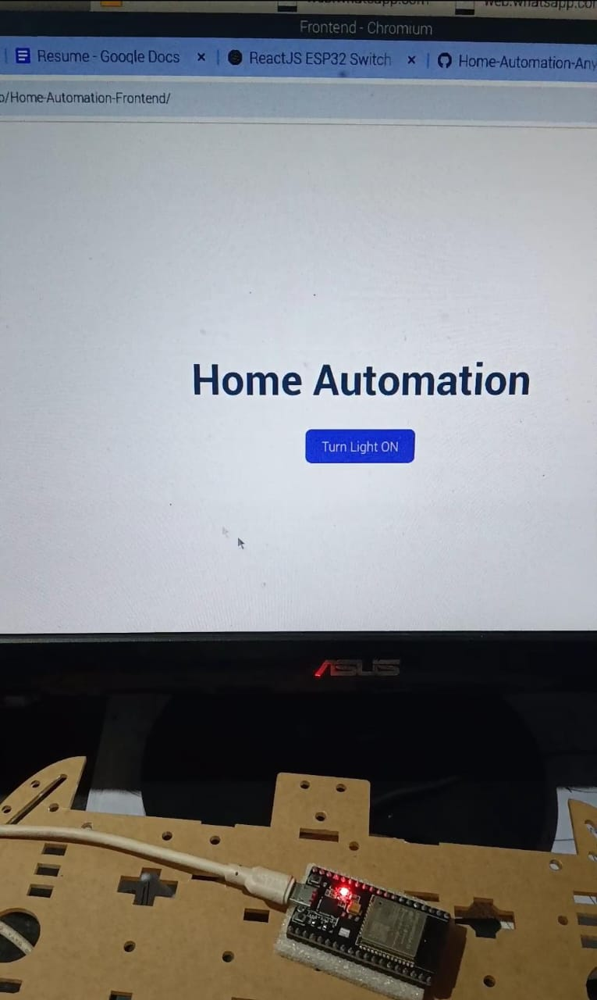
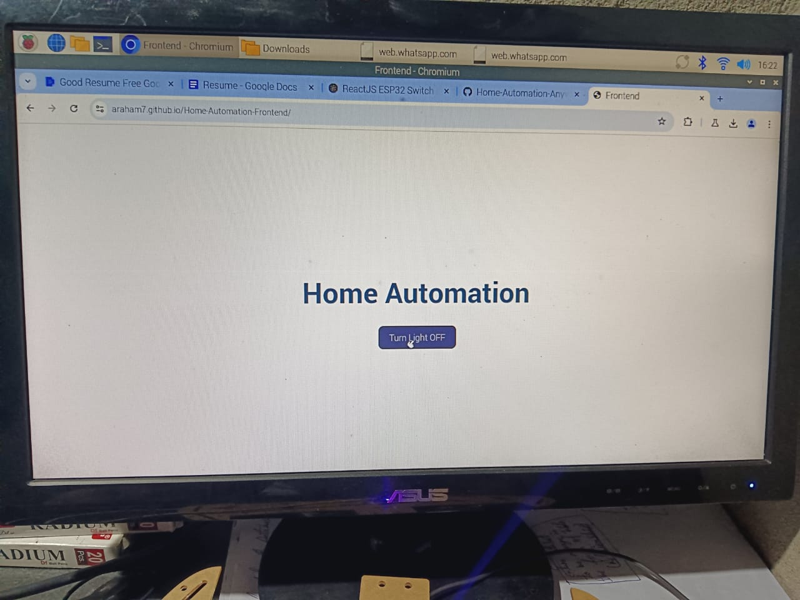
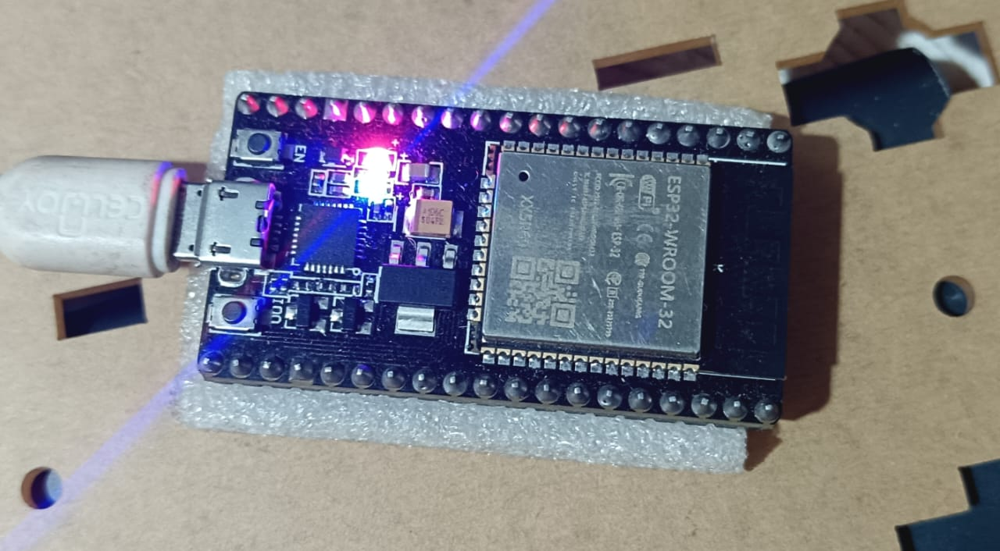

# Smart Switch using ReactJS, ESP32, and Socket.IO

This project implements a smart switch system using **ReactJS (Client)**, **ESP32 (Client)**, and a **Node.js server with Socket.IO**. The server is hosted on **Render**, allowing switching actions from anywhere in the world.

---

## 🚀 Project Overview
- **ReactJS Client**: Performs the switching action and communicates with the Socket.IO server.
- **ESP32 Client**: Listens for switching events from the server and controls the physical switch accordingly.
- **Socket.IO Server**: Acts as a bridge between ReactJS and ESP32, handling real-time communication.
- **Render Hosting**: The server is hosted on Render, making it accessible globally.

---

## 🛠️ Tech Stack
- **Frontend:** ReactJS, Socket.IO Client
- **Backend:** Node.js, Express, Socket.IO
- **Embedded System:** ESP32, Arduino (ESP32 library for WebSockets/HTTP)
- **Hosting:** Render (Server)

---

## Setup and Installation

### 1️ Server Setup (Node.js + Socket.IO)
1. Clone the repository:
   ```sh
   git clone https://github.com/Araham7/Home-Automation-Anywhere-Smart-Switch-.git
   cd Home-Automation-Anywhere-Smart-Switch-
   ```
2. Install dependencies:
   ```sh
   npm install
   ```
3. Start the server:
   ```sh
   node index.js
   ```

### 2️ ReactJS Client Setup
1. Navigate to the React client folder:
   ```sh
   cd ../client
   ```
2. Install dependencies:
   ```sh
   npm install
   ```
3. Start the React app:
   ```sh
   npm start
   ```
4. Open `http://localhost:3000` in your browser.

### 3️⃣ ESP32 Setup
1. Install **Arduino IDE** and add ESP32 board support.
2. Install required libraries:
   - WebSockets
   - WiFi
   - ArduinoJson
3. Upload the provided ESP32 sketch to your ESP32.
4. ESP32 will connect to the WebSocket server and listen for switching events.

---

## 📡 How It Works
1. **ReactJS Client** sends a switching request via Socket.IO.
2. **Socket.IO Server** broadcasts the event to all connected clients.
3. **ESP32 Client** listens for the switching event and performs the necessary action (e.g., turning on/off a relay or LED).
4. The state is updated in real-time across all clients.

---

## 🌍 Global Access
- Since the server is hosted on **Render**, the ReactJS client and ESP32 can communicate from any location worldwide.
- Ensure your ESP32 is connected to the internet and can reach the hosted server.

---

## 🔥 Features
✅ Remote switching from anywhere in the world 🌍  
✅ Real-time state updates using Socket.IO 📡  
✅ Low-latency WebSocket communication ⚡  
✅ Easy to expand for more devices 💡  

---

## 🎥 Video Demonstration
Watch the project in action:(Tap on the Image to watch video)
[](https://youtu.be/SberzcqpUqo?si=JaSv6EqqUSMRk4Cj)

---

## Images
### ReactJS Client


### ESP32 Setup


---

## Future Improvements
- Add authentication for secure access.
- Create a mobile-friendly UI.
- Implement MQTT for an alternative communication protocol.

---

## License
This project is open-source and available under the [MIT License](LICENSE).

---

## Feedback & Contributions
Feel free to contribute by submitting pull requests or opening issues!

Contact: arahamabeddin7@gmail.com

